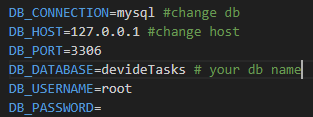

# DivideTask

## Requirements
* **XAMPP** (PHP,MySQL,APACHE)
* **Composer**
* **npm**
  
## Installing
### git clone
```
git clone https://github.com/Ruslan0503/dividetask.git
```
```
cd dividetask
composer install
```
## Launch the program
* **Step1.**
    change the database to mysql and name to dividetasks in .env <br>
  
* **Step2.**
    run this code on the folder in the project located:
```
  php artisan migrate
```
### Create store link
```
php  artisan storage:link
```
* **Step3.***
    run the project by:
```
  php artisan serve
```
* **Step4.**
    open the **[ localhost: 127.0.0.8000 ]**
* **Step5.**
    You have to register two times in different browsers in order to test the project. One user should be assignment and another one should be performer


# 2024

    
